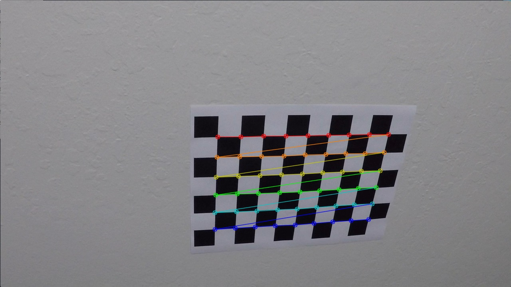
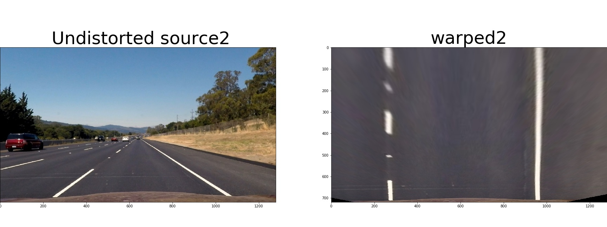
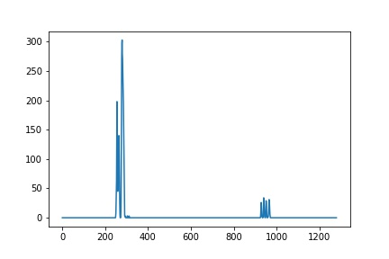
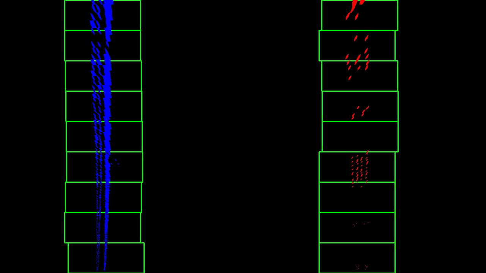
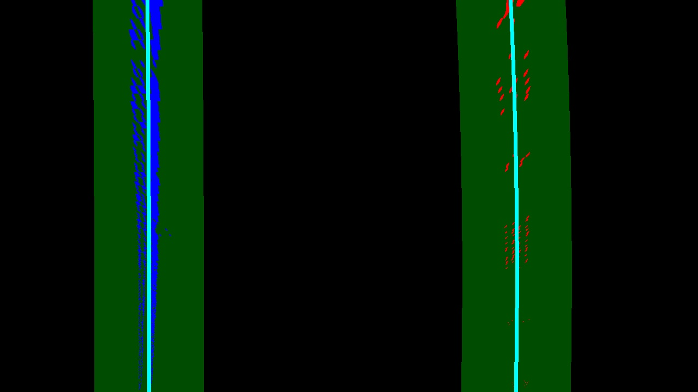
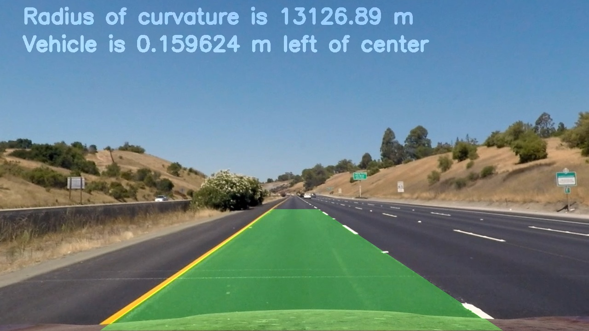

## Writeup Template

### You can use this file as a template for your writeup if you want to submit it as a markdown file, but feel free to use some other method and submit a pdf if you prefer.

---

**Advanced Lane Finding Project**

The goals / steps of this project are the following:

* Compute the camera calibration matrix and distortion coefficients given a set of chessboard images.
* Apply a distortion correction to raw images.
* Use color transforms, gradients, etc., to create a thresholded binary image.
* Apply a perspective transform to rectify binary image ("birds-eye view").
* Detect lane pixels and fit to find the lane boundary.
* Determine the curvature of the lane and vehicle position with respect to center.
* Warp the detected lane boundaries back onto the original image.
* Output visual display of the lane boundaries and numerical estimation of lane curvature and vehicle position.

## [Rubric](https://review.udacity.com/#!/rubrics/571/view) Points

### Here I will consider the rubric points individually and describe how I addressed each point in my implementation.  

---

### Writeup / README

#### 1. Provide a Writeup / README that includes all the rubric points and how you addressed each one.  You can submit your writeup as markdown or pdf.  [Here](https://github.com/udacity/CarND-Advanced-Lane-Lines/blob/master/writeup_template.md) is a template writeup for this project you can use as a guide and a starting point.  

Most of the code is re-used from the lessons and modified a bit also along with different names  for fucntion calls.

### Camera Calibration

#### 1. Briefly state how you computed the camera matrix and distortion coefficients. Provide an example of a distortion corrected calibration image.

In the first, corners are defined based on the images given for the calibration.
nx = 9 ->corners in x-direction, ny =6 -> corners in y direction. object points are the (x, y, z) coordinates of the chessboard corners in the world. Here I am assuming the chessboard is fixed on the (x, y) plane at z=0, such that the object points are the same for each calibration image. Hence, objp is just a replicated array of coordinates, and objpoints are appended with a copy of it every time. Out of 20 given calibration , 3 are failed as the corners doesnt fit in the frame and 17 successfully detect all chessboard corners in a test image. imgpoints will be appended with the (x, y) pixel position of each of the corners in the image plane with each successful chessboard detection.
The detected corners and drawn on the chessboard images can be found at 

Example of one output image is provided here 

### Pipeline (single images)

#### 1. Provide an example of a distortion-corrected image.

The raw images of given camera calibration files are read using mpimg.imread and then cv2.undistort() function is used with calculated calibrated camera co-efficients mtx, dist to get the distortion-corrected images. All the undistorted images can be found at 

Raw image before applying distortion correction. 

Example of one of undistorted output image  after applying cv2.undist fucntion is provided here 

Raw image before applying distortion correction for the test image. 

Undistorted of the test image. 

All the distort corrected images are store in this path 

#### 2. Describe how (and identify where in your code) you used color transforms, gradients or other methods to create a thresholded binary image.  Provide an example of a binary image result.

In this step, I have considered and define the following funtions to calculate several gradient measurements (x, y, magnitude, direction and color)

Calculate directional gradient: abs_sobel_thresh()-->common gradient function is defined with parameter orient which helps to differentiate whether it is in the 'x' or 'y' direction. After applying the x-directional gradient the following output has been produced for one of the given test image.

After applying the y-directional gradient the following output has been produced for one of the given test image.

Calculate gradient magnitude: mag_thresh()

Using the calculated directional gradients, magnitude threshold is applied and the following output has been produced for one of the given test image.

Calculate gradient direction: dir_threshold()

Using the calculated directional gradients, gradient threshold is applied and the following output has been produced for one of the given test image.

Calculate RGB color threshold: In this only R factor is considered to calculate the gradient as learnt from the class.
    def color_RGBtransform(img, thresh):
     
        R = img[:,:,0]    
        r_binary = np.zeros_like(R)
        r_binary[(R > thresh[0]) & (R <= thresh[1])] = 1

        return r_binary

After applying the RGB color threshold for only R the following output has been produced for one of the given test image .

Calculate HLS color threshold: In this step, HLS color transform is performed and only s factor is considered for threshold image as it is more than enough for this scenario.

def color_HLStransform(img, s_thresh):  
    
    ls = cv2.cvtColor(img, cv2.COLOR_RGB2HLS) # convert the undistored image to gray
        
    S = ls[:,:,2]   
    s_binary = np.zeros_like(S)
    s_binary[(S > s_thresh[0]) & (S <= s_thresh[1])] = 1
    
    return s_binary 

After applying the HLR color threshold for only S the following output has been produced for one of the given test image .

Then, combinedthreshold() function is applied which returns combined.

def combined_thresh(gradx, grady, mag, gradir, s_binary, r_binary, sobel_kernel = 9):
    
    combined = np.zeros_like(s_binary)
    combined[((gradx == 1) & (grady == 1)) | ((mag == 1) & (gradir == 1)) & (s_binary ==1) & (r_binary ==1)] = 1

    return combined
    
The output of combined image will be used to identify lane lines in later steps.
Combining all the gradients, color thresholds using the combined_thresh function the following output has been produced for one of the given test image .

Below, I have copied the result of applying each function to all given images:

 

#### 3. Describe how (and identify where in your code) you performed a perspective transform and provide an example of a transformed image.

In this step,the distortion corrected of all the given test images are used to transform to a "birds eye view". This is really need to get the top-view of lane which later helps to find the curvature information of the road.

The size of the image is calculated which is need to apply inverse perspective tarnsform.

First, the source coordinates corresponding to a trapezoid in the image are defined manually after doing some trails by looking at the size of image, and destiantion co-ordinates defined would look like a rectangle from birds_eye view.

Then, cv2.getPerspectiveTransform is used to calculate both, the perpective transform M and the inverse perpective transform MinV. M and MinV are used respectively in the later steps to warp and unwarp the video images.

Please find below the result of warping an image after transforming its perpective to birds-eye view. 

The wraped image with destination points and original undistored image source points for one of the test image is provided below

The wraped image of all the test images can be found at 

#### 4. Describe how (and identify where in your code) you identified lane-line pixels and fit their positions with a polynomial?

After applying calibration, thresholding, and a perspective transform to a road images and now in order to detect the lane-line pixels histogram method is used.

A function called hist() is defined as mentioned below
def hist(img):
    
    bottom_half = img[img.shape[0]//2:,:]
    
    histogram = np.sum(bottom_half, axis=0)
    
    # Find the peak of the left and right halves of the histogram
    
    # These will be the starting point for the left and right lines
    midpoint = np.int(histogram.shape[0]//2)
    
    leftx_base = np.argmax(histogram[:midpoint])
    
    rightx_base = np.argmax(histogram[midpoint:]) + midpoint
    
    return histogram, leftx_base, rightx_base

left and right starting lanes positions are selected by looking to the max value of the histogram to the left and the right of the histogram's mid position. The output of histogram for one the warped image is shown below

Sliding Window technique is used to identify the most likely coordinates of the lane-lines in a window, which slides vertically through the image for both the left and right line. Using the previously calculated coordinates (lines function), a second order polynomial is calculated for both the left and right lane line(fit_polynomial function) Numpy's standar polyfit function i.e.. np.polyfit is used to calculate the polynomials. 

The function lines and fit_polynomial for wraped image is defined as mentioned below.

def lines(binary_warped):
    
    # Take a histogram of the bottom half of the image
    histogram, leftx_base, rightx_base = hist(binary_warped)  
    
    # Create an output image to draw on and visualize the result
    out_img = np.dstack((binary_warped, binary_warped, binary_warped))
    
    # HYPERPARAMETERS
    # Choose the number of sliding windows
    nwindows = 9
    
    # Set the width of the windows +/- margin
    margin = 100
    
    # Set minimum number of pixels found to recenter window
    minpix = 50

    # Set height of windows - based on nwindows above and image shape
    window_height = np.int(binary_warped.shape[0]//nwindows)
    
    # Identify the x and y positions of all nonzero pixels in the image
    nonzero = binary_warped.nonzero()
    nonzeroy = np.array(nonzero[0])
    nonzerox = np.array(nonzero[1])
    
    # Current positions to be updated later for each window in nwindows
    leftx_current = leftx_base
    rightx_current = rightx_base

    # Create empty lists to receive left and right lane pixel indices
    left_lane_inds = []
    right_lane_inds = []

    # Step through the windows one by one
    for window in range(nwindows):
        # Identify window boundaries in x and y (and right and left)
        win_y_low = binary_warped.shape[0] - (window+1)*window_height
        win_y_high = binary_warped.shape[0] - window*window_height
        win_xleft_low = leftx_current - margin
        win_xleft_high = leftx_current + margin
        win_xright_low = rightx_current - margin
        win_xright_high = rightx_current + margin
        
        # Draw the windows on the visualization image
        cv2.rectangle(out_img,(win_xleft_low,win_y_low),
        (win_xleft_high,win_y_high),(0,255,0), 2) 
        cv2.rectangle(out_img,(win_xright_low,win_y_low),
        (win_xright_high,win_y_high),(0,255,0), 2) 
        
        # Identify the nonzero pixels in x and y within the window #
        good_left_inds = ((nonzeroy >= win_y_low) & (nonzeroy < win_y_high) & 
        (nonzerox >= win_xleft_low) &  (nonzerox < win_xleft_high)).nonzero()[0]
        good_right_inds = ((nonzeroy >= win_y_low) & (nonzeroy < win_y_high) & 
        (nonzerox >= win_xright_low) &  (nonzerox < win_xright_high)).nonzero()[0]
        
        # Append these indices to the lists
        left_lane_inds.append(good_left_inds)
        right_lane_inds.append(good_right_inds)
        
        # If you found > minpix pixels, recenter next window on their mean position
        if len(good_left_inds) > minpix:
            leftx_current = np.int(np.mean(nonzerox[good_left_inds]))
        if len(good_right_inds) > minpix:        
            rightx_current = np.int(np.mean(nonzerox[good_right_inds]))

    # Concatenate the arrays of indices (previously was a list of lists of pixels)
    try:
        left_lane_inds = np.concatenate(left_lane_inds)
        right_lane_inds = np.concatenate(right_lane_inds)
        
    except ValueError:
        # Avoids an error if the above is not implemented fully
        pass

    # Extract left and right line pixel positions
    leftx = nonzerox[left_lane_inds]
    lefty = nonzeroy[left_lane_inds] 
    rightx = nonzerox[right_lane_inds]
    righty = nonzeroy[right_lane_inds]

    return leftx, lefty, rightx, righty, out_img

def fit_polynomial(binary_warped):
    
    # Find our lane pixels first
    leftx, lefty, rightx, righty, out_img  = lines(binary_warped)
    
    # Fit a second order polynomial to each using `np.polyfit`
    left_fit = np.polyfit(lefty, leftx, 2)
    right_fit = np.polyfit(righty, rightx, 2)

    # Generate x and y values for plotting
    ploty = np.linspace(0, binary_warped.shape[0]-1, binary_warped.shape[0] )

    #Calc both polynomials using ploty, left_fit and right_fit ###
    left_fitx = left_fit[0]*ploty**2 + left_fit[1]*ploty + left_fit[2]
    
    right_fitx = right_fit[0]*ploty**2 + right_fit[1]*ploty + right_fit[2]

    ## Visualization ##
    # Colors in the left and right lane regions
    out_img[lefty, leftx] = [255, 0, 0]
    out_img[righty, rightx] = [0, 0, 255]
            
    return out_img, left_fit, right_fit, left_fitx, ploty, right_fitx, ploty

Fit polynomial function is called, inside this the line() function is also invoked. After applying fit_polynomial function for one of warped image, the following output is obtained.

As learnt from the lesson, lane lines don't necessarily change/move a lot from frame to frame.In the next frame of video we don't need to do a blind search again, but we could just search in a margin around the previous lane line position. Thus,the area to search for activated pixels based on margin out from fit_polynomial is used to detect the similar lines. A fucntion called identify_similar_lines is used to skip sliding windows once the line is found.

def identify_similar_lines(binary_warped, left_fit, right_fit):
     
    nonzero = binary_warped.nonzero()
    nonzeroy = np.array(nonzero[0])
    nonzerox = np.array(nonzero[1])
    
    margin = 100
    
    left_lane_inds = ((nonzerox > (left_fit[0]*(nonzeroy**2) + left_fit[1]*nonzeroy + 
    left_fit[2] - margin)) & (nonzerox < (left_fit[0]*(nonzeroy**2) + 
    left_fit[1]*nonzeroy + left_fit[2] + margin))) 

    right_lane_inds = ((nonzerox > (right_fit[0]*(nonzeroy**2) + right_fit[1]*nonzeroy + 
    right_fit[2] - margin)) & (nonzerox < (right_fit[0]*(nonzeroy**2) + 
    right_fit[1]*nonzeroy + right_fit[2] + margin)))  

    # Again, extract left and right line pixel positions
    leftx = nonzerox[left_lane_inds]
    lefty = nonzeroy[left_lane_inds] 
    rightx = nonzerox[right_lane_inds]
    righty = nonzeroy[right_lane_inds]

    # If any of the lines could not be found, 
    # perform a more exhaustive search
    if (leftx.size == 0 or rightx.size == 0):
        return lines(binary_warped)
    
    # Fit a second order polynomial to each
    left_fit = np.polyfit(lefty, leftx, 2)
    right_fit = np.polyfit(righty, rightx, 2)
    
    # Generate x and y values for plotting
    ploty = np.linspace(0, binary_warped.shape[0] - 1, binary_warped.shape[0])
    
    left_fitx = left_fit[0]*ploty**2 + left_fit[1]*ploty + left_fit[2]
    right_fitx = right_fit[0]*ploty**2 + right_fit[1]*ploty + right_fit[2]
        
    
    # Create an image to draw on and an image to show the selection window
    out_img = np.dstack((binary_warped, binary_warped, binary_warped))*255
    window_img = np.zeros_like(out_img)

    # Generate a polygon to illustrate the search window area
    # And recast the x and y points into usable format for cv2.fillPoly()
    left_line_window1 = np.array([np.transpose(np.vstack([left_fitx - margin, ploty]))])
    left_line_window2 = np.array([np.flipud(np.transpose(np.vstack([left_fitx + margin, ploty])))])
    left_line_pts = np.hstack((left_line_window1, left_line_window2))
        
    right_line_window1 = np.array([np.transpose(np.vstack([right_fitx - margin, ploty]))])
    right_line_window2 = np.array([np.flipud(np.transpose(np.vstack([right_fitx + margin, ploty])))])
    right_line_pts = np.hstack((right_line_window1, right_line_window2))

    # Draw the lane onto the warped blank image
    cv2.fillPoly(window_img, np.int_([left_line_pts]), (0,255, 0))
    cv2.fillPoly(window_img, np.int_([right_line_pts]), (0,255, 0))
    out_img = cv2.addWeighted(out_img, 1, window_img, 0.3, 0)

    # Color in left and right line pixels
    out_img[lefty, leftx] = [255, 0, 0]
    out_img[righty, rightx] = [0, 0, 255]
     
    for index in range(binary_warped.shape[0]):
        
        cv2.circle(out_img, (int(left_fitx[index]), int(ploty[index])), 3, (255,255,0))
        cv2.circle(out_img, (int(right_fitx[index]), int(ploty[index])), 3, (255,255,0))
    
    return (left_fit, right_fit), (left_fitx, ploty), (right_fitx, ploty), out_img.astype(int)
    
    return (left_fit, right_fit), (left_fitx, ploty), (right_fitx, ploty), out_img

The identify_similar_lines() is applied for one of the warped image and following output is obtained.

#### 5. Describe how (and identify where in your code) you calculated the radius of curvature of the lane and the position of the vehicle with respect to center.

The radius of curvature is calculated based on the information that was learnt during the course of Advanced computer vision chapter.The thresholded binary image computed provides details about pixels which belong to the left and right lane lines, and fit_polynomial is applied to those pixel positions to calculate the curvature of the lane.

Average of left and right radius of curvature gives the radius curvature of the road.

Lane center is obtained as mean of the lane pixels closest to the vehicle. The center of the image gives us the position of the car. The difference between these two is the offset from the center.

#### 6. Provide an example image of your result plotted back down onto the road such that the lane area is identified clearly.

A function lane() is defined as mentioned below
def lane(img, warped, left_fitx, right_fitx, ploty, Minv, left_curverad, right_curverad, Veh_pos):
    
    # Create an image to draw the lines on
    warp_zero = np.zeros_like(warped).astype(np.uint8)
    
    color_warp = np.dstack((warp_zero, warp_zero, warp_zero))

    pts_left = np.array([np.transpose(np.vstack([left_fitx, ploty]))])
    
    pts_right = np.array([np.flipud(np.transpose(np.vstack([right_fitx, ploty])))])
    
    pts = np.hstack((pts_left, pts_right))

    # Draw the lane onto the warped blank image
    cv2.fillPoly(color_warp, np.int_([pts]), (0,255, 0))

    # Warp the blank back to original image space using inverse perspective matrix (Minv)
    newwarp = cv2.warpPerspective(color_warp, Minv, (img.shape[1], img.shape[0])) 
     
    #cv2.putText(newwarp, 'Left lane line curvature is {:.2f} m'.format(left_curverad), (50, 50), cv2.FONT_HERSHEY_SIMPLEX, 1.5, (255,255,255), 5)
    
    #cv2.putText(newwarp, 'Right lane line curvature is {:.2f} m'.format(right_curverad), (50, 110), cv2.FONT_HERSHEY_SIMPLEX, 1.5, (255,255,255), 5)
     
    cv2.putText(newwarp, 'Radius of curvature is {:.2f} m'.format((left_curverad + right_curverad)/2), 
                (50, 50), cv2.FONT_HERSHEY_SIMPLEX, 1.5, (255,255,255), 5)
    
    
    cv2.putText(newwarp, 'Vehicle is {:2f} m left of center'.format(Veh_pos), (50, 110), cv2.FONT_HERSHEY_SIMPLEX, 1.5, (255,255,255), 5)
    
    result_lane = cv2.addWeighted(img, 1, newwarp, 0.3, 0)

    # Combine the result with the original image
    return result_lane

The outputs of the lane fucntion for all test images are placed under (./ouput_images) with lane_image followed with number. One of the example for the detected lane is provided here.

### Pipeline (video)

#### 1. Provide a link to your final video output.  Your pipeline should perform reasonably well on the entire project video (wobbly lines are ok but no catastrophic failures that would cause the car to drive off the road!).

The pipeline defined to process the given input is defined as mentioned below:

def process_pipeline(img):
    
    img_size = (img.shape[1], img.shape[0])
    #calibrate camera
    ret, mtx, dist, rvecs, tvecs = cv2.calibrateCamera(objpoints, imgpoints, img_size, None, None)
    
    #remove the distortion from the image
    undist = cv2.undistort(img, mtx, dist, None, mtx)
    
    # apply, gradient, magnitude and color thresholds
    gradx, grady, mag, gradir, r_binary, s_binary, r_binary, combined_binary = process_images(undist) 
    
    #apply perspective transform
    warped, M, src, dst, MinV = per_transform(combined_binary)    

    #fit polynomial to find the area of interst
    out_img, left_fit, right_fit, left_fitx, ploty, right_fitx, ploty = fit_polynomial(warped)
    
    #detect the lane pixels
    (left_fit, right_fit), (left_fitx, ploty), (right_fitx, ploty), out = detect_similar_lines(warped,left_fit, right_fit)
    
    #find the curvature
    left_cuv, right_cuv = curvature_radius (left_fitx, right_fitx, warped, xm_per_pix=3.7/700, ym_per_pix = 30/700)
    
    #find the vehicle position
    VehPos = car_pos(warped, left_fitx, right_fitx, xm_per_pix=3.7/700)
    
    #fill the lane with all the above calculated information
    result_lane = lane(img, warped, left_fitx, right_fitx, ploty, MinV, left_cuv, right_cuv, VehPos)

    return result_lane.

The output of the pipeline video is placed here.

In case the link doesnt open please check the output videos for the result of pipeline(Couldnt figure out the reason for not opening link despite providing in right way). Thank you

### Discussion

#### 1. Briefly discuss any problems / issues you faced in your implementation of this project.  Where will your pipeline likely fail?  What could you do to make it more robust?

It was really hard to find the co-ordinates required for bird's eye view manually. The co-ordinates defined works well for the provided images. However, it might fail for the other images as it is not a genralized approach to find the lane-lines. For two images still it was not completely perfect, i tried a lot and couldnt find the right points for those so mentioning it has the shortcome of algorithm!

Also, very basic methods that were learnt during the course are applied for the threshold binary images as there is not much difference in the road conditions for the given video and iamges like darkness, lightness etc.., if the images are of different light variant then algorithm might fail to produce the same result. 

It is always better to find a generalized approach for tuning parameters to detect lane-lines. This was also one of shortoutcome previous project as well. Hope to get rid of this manuall tuning for scenrio based in the future classes. Although it looked simpler in the beginning, difficulties were udnerstood once started with project! Overall it was a good experience.
